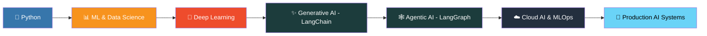

  
  
  
  
  

---

## 🧠 About Me

<table>
  <tr>

**👋 Hi, I'm Dayachand Prajapat**
An AI Developer from Jaipur, Rajasthan, India 🇮🇳, passionate about building intelligent systems — from classical ML to production-grade Agentic AI pipelines.

> *Fun fact: I'm also a Mimicry Artist ⚡*

| | |
|--|--|
| 🌱 Learning | Cloud AI · LangGraph · LangChain |
| 👯 Collaborate | RAG-based projects |
| 🤝 Exploring | Agentic AI systems |
| 💬 Ask me | Python · ML · GenAI |
| 📫 Email | dharmsinghp223@gmail.com |

---

## 🛠️ My Tech Arsenal

### 🤖 Machine Learning

  
  
  

### 📊 Data Visualization

  
  
  

### 🔍 Data Analysis

  
  
  
  

### 🧬 Deep Learning

  
  

### ✨ Generative AI

  
  
  
  

### 🕸️ Agentic AI

  
  
  

### ☁️ Cloud AI & MLOps

  
  
  
  
  
  
  

### 🔧 Backend & Databases

  
  
  
  
  
  

---

## 📈 GitHub Analytics

---

## 🏆 GitHub Trophies

---

## 🗺️ Learning Roadmap

---

## 📬 Let's Connect

| Platform | Link |
|----------|------|
| 💼 LinkedIn | [dayacahnd-prajapat](https://linkedin.com/in/dayacahnd-prajapat) |
| 📊 Kaggle | [dayachand-prajapat](https://kaggle.com/dayachand-prajapat) |
| 💻 LeetCode | [dayachand-prajapat](https://leetcode.com/dayachand-prajapat) |
| 🏆 TopCoder | [122010](https://www.topcoder.com/members/122010) |
| 📸 Instagram | [@prajapatdaya_](https://instagram.com/prajapatdaya_) |
| 📧 Email | dharmsinghp223@gmail.com |

---

**⭐ If you like my work, consider starring some repositories!**

*"The best way to predict the future is to create it." – Peter Drucker*

